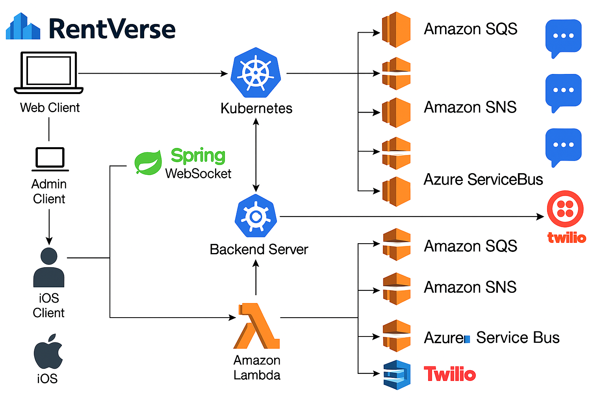
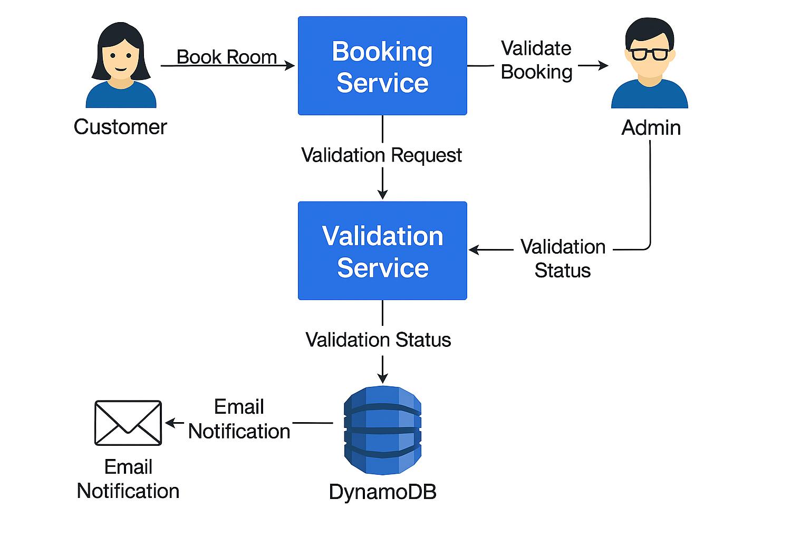
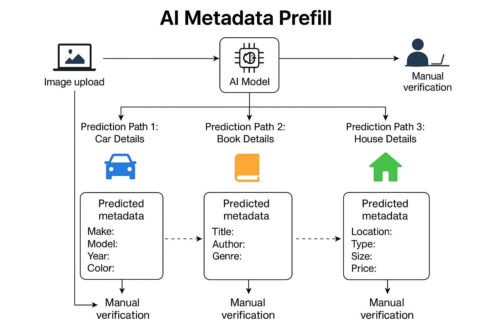
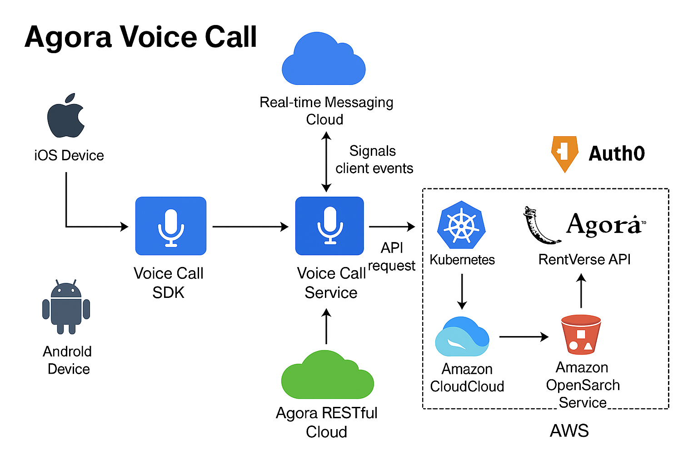
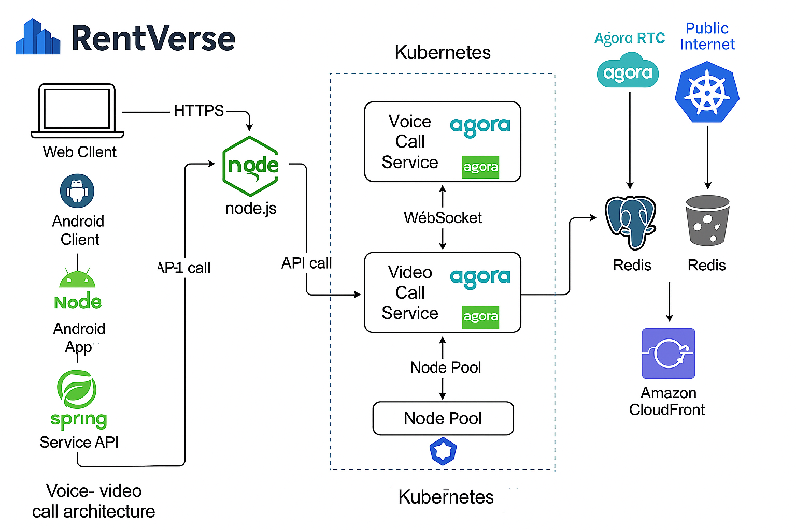
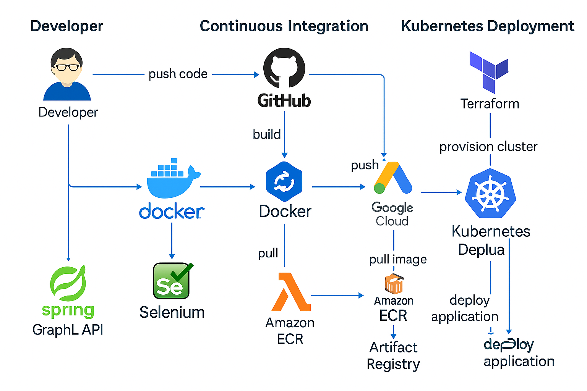
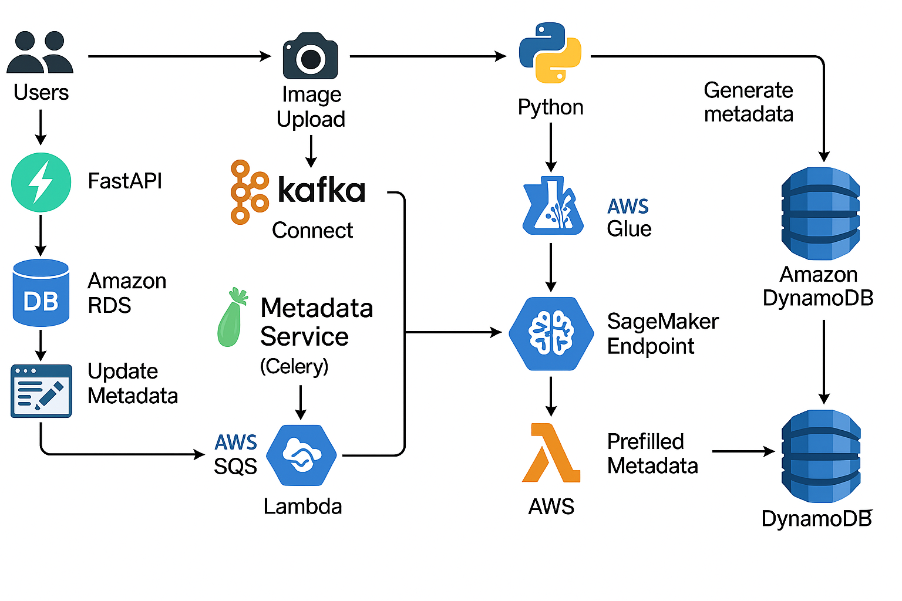
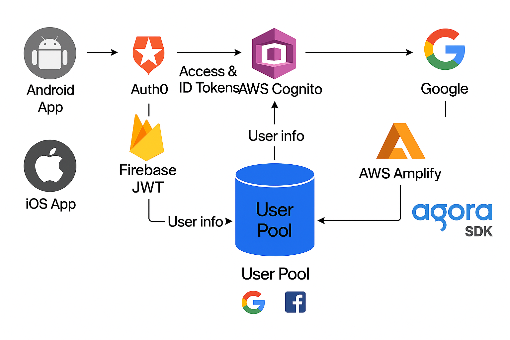
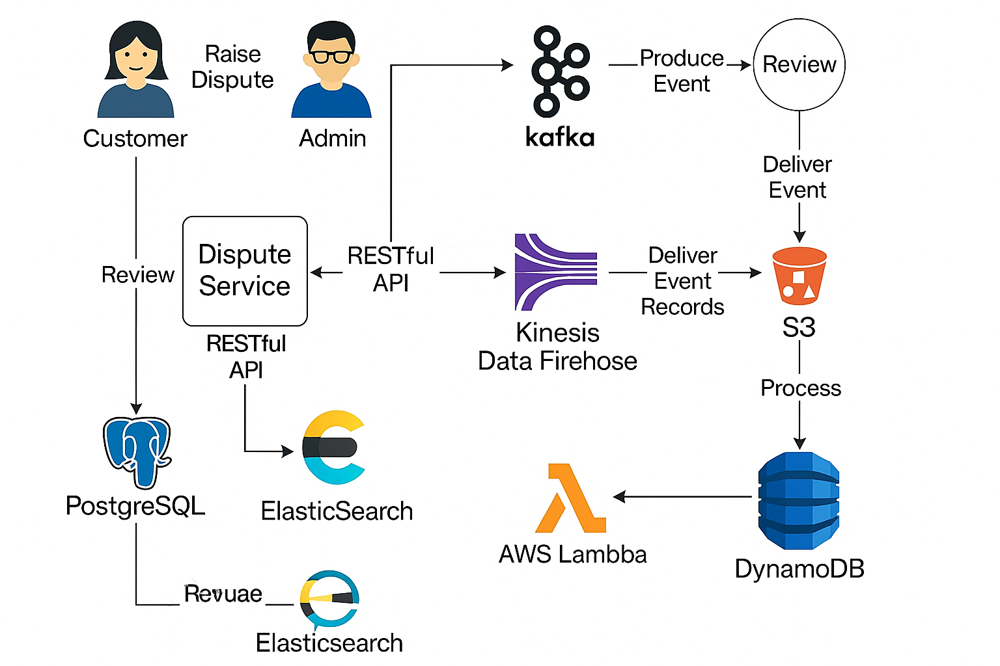

# Rentverse

**Rentverse** is a scalable, multi-domain rental platform that enables users to rent **houses**, **cars**, and **books** with advanced features like **KYC verification**, **premium subscriptions**, **GPS tracking**, **voice call support**, and **AI-assisted metadata prefill**. Designed for real-world deployment, Rentverse ensures fairness, transparency, and powerful search and dispute resolution systems across all rental flows.

## 🔧 RentVerse Architecture Diagrams

<table>
  <tr>
    <td align="center">
       
      <b>A_detailed_architectural_diagram_illustrates_RentV.png</b>
    </td>
    <td align="center">
       
      <b>RentVerse Web Architecture Diagram.png</b>
    </td>
  </tr>
  <tr>
    <td align="center">
       
      <b>file_00000000803c61f8a3081131c2659711.png</b>
    </td>
    <td align="center">
       
      <b>Kubernetes Cluster with Monitoring Architecture.png</b>
    </td>
  </tr>
  <tr>
    <td align="center">
       
      <b>Kubernetes Autoscaling Flowchart with AWS.png</b>
    </td>
    <td align="center">
       
      <b>Data Flow Architecture_ Power BI System.png</b>
    </td>
  </tr>
  <tr>
    <td align="center">
       
      <b>A_flowchart_diagram_illustrates_an_AI_metadata_pre.png</b>
    </td>
    <td align="center">
       
      <b>A_diagram_displays_the_Agora_Voice_Call_architectu.png</b>
    </td>
  </tr>
  <tr>
    <td align="center">
       
      <b>A_flowchart_diagram_showcases_the_voice_and_video_.png</b>
    </td>
    <td align="center">
       
      <b>A_flowchart_in_the_image_illustrates_the_Continuou.png</b>
    </td>
  </tr>
  <tr>
    <td align="center">
       
      <b>file_00000000cfd861f6a19e82b0b05e847a.png</b>
    </td>
    <td align="center">
       
      <b>file_000000006f1461f699ec7c936fbdd9fa.png</b>
    </td>
  </tr>
  <tr>
    <td align="center">
       
      <b>file_000000007c0861f68ced3de52203aec9.png</b>
    </td>
    <td align="center">
       
      <b>AWS Data Analysis Architecture Overview.png</b>
    </td>
  </tr>
</table>

### 🏗️ RentVerse Architecture

📄 [Rentverse Architecture Document (PDF)](https://github.com/sriraghava9991/Rentverse/raw/main/Rentverse_Architecture.pdf)

## 🚀 Features

### ✅ Core Functionalities
- House, Car, and Book rental flows
- KYC verification (Aadhaar/PAN/DL, image OCR)
- Owner and Tenant roles with review/rating system
- AI metadata prefill (title, author, license plate, furnishing, etc.)
- Booking with flexible advance payments and shared rentals
- Optional Check-in/Check-out photos/videos for dispute safety

### 🛡️ Security and Fairness
- 2FA with OTP + password login
- Admin override and role-based access control
- Transparent review system (KYC-based visibility)
- Dispute resolution, tenant-owner chat, booking history logs

### 🌐 Premium Features
- Premium-only filters (weather, power, radius, map sort, etc.)
- Lifetime premium via KYC gift points (up to ₹999)
- Premium voice calling via Agora (with mock fallback)
- Demo video flows and in-app tutorials with gamified completion

### 📍 GPS Integration
- Renter phone or car device-based GPS (privacy-safe)
- Owner visibility only after rental end
- Consent-based fallback and last known location rules

---

## 🏗️ Architecture

The architecture follows a **microservices-based backend** with a **React frontend**, containerized via Docker and deployed on **Kubernetes**, with PostgreSQL and MongoDB databases. Queues and batch jobs are managed via AWS SQS and Batch, and image/video uploads go through S3 with GuardDuty scan wait.
